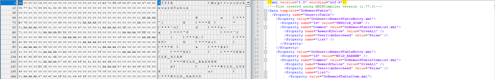

# MBINCompiler

## What is MBINCompiler?

MBINCompiler is a modding tool for the game: [No Man's Sky](https://www.nomanssky.com/) that converts the game's MBIN data files (binary) into human-readable EXML files (text) that can be edited with any text editor and then converted back again for use in a modded game.

Various MBIN files have different data formats. MBINCompiler maps all of these formats to be able to understand how to read the binary data from file, convert it to EXML and vice versa.

**Please note** that every update to the game breaks any number of MBIN formats. This requires updating MBINCompiler for each game update and depending on the size and frequency of updates, can take some time so please be patient as new game updates roll out.

Because each version of MBINCompiler is tied to a specific version of NMS, it is also **very important to note** that MBIN files compiled with a previous version may not be decompiled successfully with a newer version of MBINCompiler if that particular MBIN format has changed. The correct version of MBINCompiler should be used to decompile the corresponding file, then it can be updated and recompiled with the newer version.

If you need to find out what version of MBINCompiler to download for a particular MBIN file, there is a `--version` command line option that will tell you what version the MBIN file was compiled with. You can get more information about the command line options in the [User Documentation](./Usage#command-line)

If you are a developer, you can access all the functionality that MBINCompiler uses for it's own command line interface by downloading or compiling the libMBIN.dll and linking it in your own application. The API makes things like MBIN/EXML de/serialization acessible as well as all the MBIN structure definitions. The structures are C# classes that map the mbin data as public fields, so they can be used in code like any other class. To read more about libMBIN see [here](./libmbin/usage)

If you need help, would like to help or just interested in NMS modding, check out the [No Man's Sky Modding Server](https://discordapp.com/invite/3Ytkxss) on discord chat.
