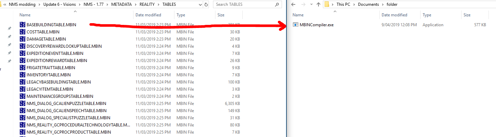

## Usage

If you are new to modding in NMS, check out the [NMS Modding Wiki](https://nmsmodding.wikia.com/wiki/No_Man%27s_Sky_Modding_Wiki) for how to get started before you continue with MBINCompiler.  
The getting started guide can be found [here](https://nmsmodding.fandom.com/wiki/Getting_Started).

MBINCompiler can be used in two ways; via command line, or by using drag-and-drop in Windows Explorer.

### Drag-and-drop

1. In one window have the files you wish to convert, and the other window have the folder containing `MBINCompiler.exe`
2. Drag the `.MBIN` file onto `MBINCompiler.exe`, and an `.EXML` file will be produced in the same location as the source `.MBIN` file.
   An entire folder can be dragged onto `MBINCompiler.exe` which will convert any `.MBIN` files contained within the folder recursively.
3. Edit the `.EXML` file with a text editor such as [Notepad++](https://notepad-plus-plus.org/).
4. Drag the `.EXML` file onto `MBINCompiler.exe`, and an `.MBIN` file will be produced in the same location as the source `.EXML` file. You will be prompted to overwrite any previously existing files.

### Command line

Coming soon!!
